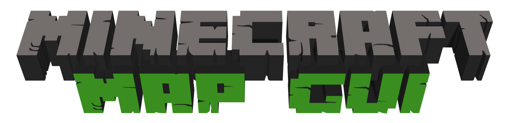

# Minecraft Map Gui
## A simple to use application to manage servers for playing custom maps.

# Installing
[todo]

# Building
- Download source code of the project.
  - Can be opened in any text editor or IDE thats supports node.js
- Compile the application using [electron-packager](https://github.com/electron/electron-packager)\
`electron-packager . MinecraftMapGUI --platform=<platform>`

# Issues and Feature Requests
If any issues are found or you would like to request a feature, feel free to [create an issue](https://github.com/Kappabyte/MinecraftMapGUI/issues/new/choose) on the github page. \
If you are a developer and wish to implement a new feature, please link your pull request to an existing feature request.